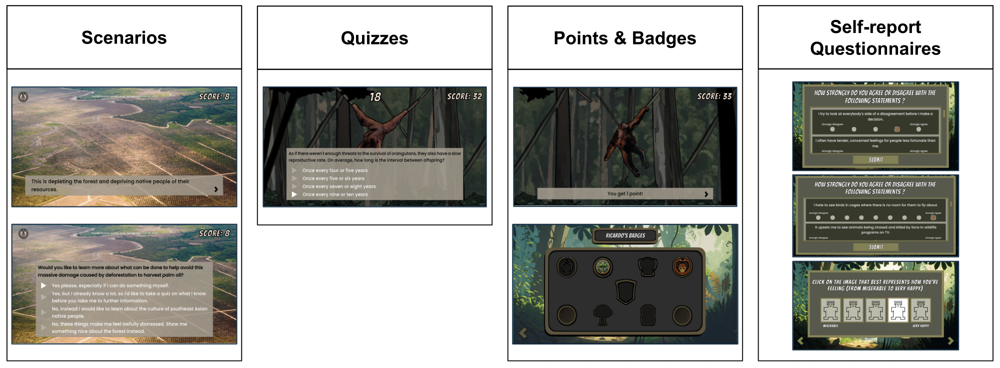

 

A serious game for promoting environmentally sustainable behaviors through empathy, embedded in a web-app that supports it.

While the game was developed with Unity, the web-app itself is based on a MEAN stack framework:
 - The front-end consists of an **Angular** single-page application that embeds the game in Unity WebGL format.
 - The back-end consists of an **Express.js** application server running on top of **Node.js**, and a **MongoDB** database.

This project was originally developed in the context of my Master’s thesis. I have continued to refine it and expand its documentation since then.

The web-app can be accessed [here](https://savedforest-temp-test-2.onrender.com/).

> [!NOTE]
> As the back-end server is currently hosted on a free [Render](https://render.com/) instance, it takes a bit for it to restart after being inactive. This can often lead to noticeable loading times, especially when logging in or signing up.
> 
> While you wait, you might want to check out that weird shaking tree on the screen...

## Overview

“saveDforest” is a single-player serious game that aims to promote environmentally sustainable behaviors that benefit the Borneo rainforest. 

To achieve this goal, the game relies on fostering empathy towards people and animals directly affected by Borneo’s deforestation, as empathy drives prosocial behaviors.

The game contains **scenarios**, **quizzes**, a reward system consisting of **points and badges**, and **self-report questionnaires** - IRIs[^1], AESs[^2], and SAMs[^3] - to measure empathy and emotional response changes.

Generally, whenever the player does an in-game action that involves
creating/reading/updating/deleting data from the MongoDB database, the following occurs:

1. The game calls a specific method in the Angular app;
   
2. The Angular app sends an HTTP request to a corresponding API endpoint on the Express.js server;

3. After validating the request, the Express server delegates an appropriate operation to the MongoDB database;

4. Once the operation completes (whether successfully or not), the Express server sends an HTTP response back to the Angular app;

5. Upon receiving the response, the Angular app will call a specific method in the game, so it can proceed accordingly.

## saveDforest repositories 

- **[saveDforest-frontend](https://github.com/ricardosantosfc/savedforest-frontend-public)** - Front-end Angular project
  
- [saveDforest-backend](https://github.com/ricardosantosfc/savedforest-backend-public) - Back-end Express server project
  
- saveDforest-unity-game - Unity game project (*coming soon...*)
  
## Documentation

- [saveDforest-documentation](https://ricardosantosfc.github.io/saveDforest/docs/savedforest_documentation.pdf) - Details the projects' structure and source code, along with prerequisite specifications, setup procedures, and instructions for local execution and deployment.
  
- [saveDforest-API](https://ricardosantosfc.github.io/saveDforest/docs/swaggerUI) - Details the app's RESTful API, described using OpenAPI specification and served through Swagger.

## Promotional video

[^1]: Mark H. Davis. 1983. Measuring individual differences in empathy: Evidence for a
multidimensional approach. Journal of Personality and Social Psychology 44, 1 (January 1983),
113–126. DOI:https://doi.org/10.1037/0022-3514.44.1.113

[^2]: Elizabeth S. Paul. 2000. Empathy with Animals and with Humans: Are They Linked?
Anthrozoös 13, 4 (December 2000), 194–202.
DOI:https://doi.org/10.2752/089279300786999699

[^3]: Margaret M. Bradley and Peter J. Lang. 1994. Measuring emotion: The self-assessment
manikin and the semantic differential. Journal of Behavior Therapy and Experimental
Psychiatry 25, 1 (March 1994), 49–59. DOI:https://doi.org/10.1016/0005-7916(94)90063-9
